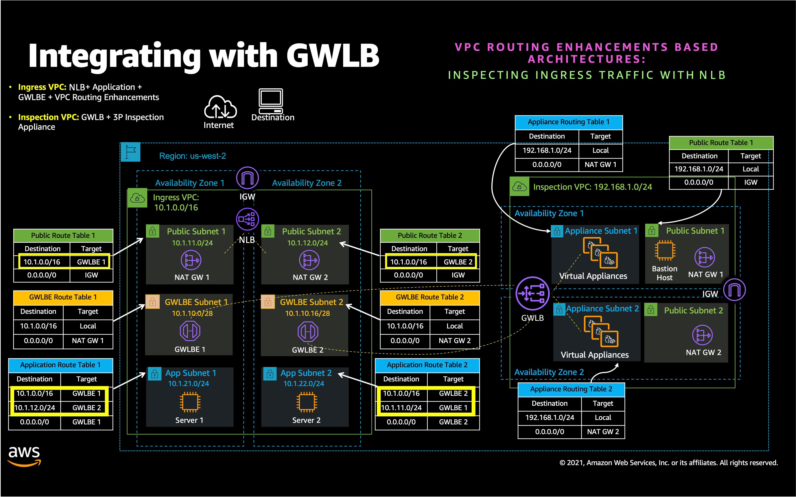

### VPC Routing Enhancement Based Architectures

## Welcome

* [Introduction](#introduction)
* [Deploying templates](#deploying-templates)
* [Inspection VPC](#inspection-vpc)
* [Spoke VPCs](#spoke-vpcs)
  * [Inspect traffic between resources in private subnet and NAT gateway](#inspect-traffic-between-resources-in-private-subnet-and-nat-gateway)
  * [Application Load Balancer based ingress traffic inspection](#application-load-balancer-based-ingress-traffic-inspection)

## Introduction:

* [New VPC routing enhancements](https://aws.amazon.com/about-aws/whats-new/2021/08/amazon-vpc-subnets/) allows you to configure routes in your subnet route tables to forward traffic between two subnets in a VPC, via virtual appliances such as network firewalls, intrusion detection and protection systems, etc. Routing enhancements allow you to route traffic between two subnets to a middlebox appliance. You can do so by creating a route for one subnet route table that matches the subnet CIDR of the other subnet and specifies a Gateway Load Balancer (GWLB) endpoint, NAT gateway, Network Firewall endpoint, or the network interface for an appliance as a target. Alternatively, to redirect all traffic from the subnet to any other subnet, replace the target of the local route with a Gateway Load Balancer endpoint, NAT gateway, or network interface.

  For more details, refer to [Routing for a middlebox appliance Example](https://docs.aws.amazon.com/vpc/latest/userguide/route-table-options.html#route-tables-appliance-routing) and [Amazon VPC Routing Enhancements Allow You to Inspect Traffic Between Subnets In a VPC blog](https://aws.amazon.com/blogs/aws/inspect-subnet-to-subnet-traffic-with-amazon-vpc-more-specific-routing/).

* This section contains sample AWS Cloudformation templates that demonstrates how to create inspection architecture using AWS Gateway Load Balancer, Gateway Load Balancer Endpoints and VPC routing enhancements from templates that are written in YAML. Templates are for sample purpose.

## Deploying templates:

* VPC routing enhancements based architectures are deployed using a distributed model. In a distributed model
  * GWLB and inspection appliances are hosted in a separate VPC. In this section, this vpc is referred to as *Inspection VPC*
  * GWLB endpoints are created/distributed across different VPCs whose traffic needs to be inspected. In this section, these different VPCs are referred to as *Egress VPC, Ingress VPC, Spoke VPC* etc.
  * These distributed endpoints are connected to GWLB based VPC endpoint service hosted Inspection VPC

* **You first need to create/deploy Inspection VPC sample template followed by Spoke VPCs.**

## Inspection VPC:

* [Sample template: Inspection VPC](templates/InspectionVpc.yaml) when deployed, creates architecture as depicted in Figure 1. The architecture creates Inspection VPC consisting of GWLB, inspection appliances and GWLB based endpoint service.

*Figure 1: Inspection VPC*

Inspection appliance consists of [Amazon Linux 2 EC2 instances configured in hairpin mode](../../aws-cli/gwlb/configure_iptables_al2.md). In this mode, appliance sends all the traffic that it receives from GWLB back to GWLB on same interface.

## Spoke VPCs:

* ### Inspect traffic between resources in private subnet and NAT gateway:

  * ***Note:** Before deploying the following template, make sure you have created/deployed Inspection VPC template*

  * [Sample template: Inspect traffic between private resource and NAT gateway](templates/EgressVpcNatGw.yaml) when deployed, creates architecture as depicted in Figure 2. The architecture allows you to inspect traffic between private resources and NAT gateway using VPC routing enhancements and GWLB endpoint.

*Figure 2: Inspecting traffic between private workload and NAT gateway*

  * Validation Steps:
    * [Validation: Inspect traffic between private resource and NAT gateway](EgressVpcNatGw.md)

* ### Application Load Balancer based ingress traffic inspection:

  * ***Note:** Before deploying the following template, make sure you have created/deployed Inspection VPC template*

  * [Sample template: Inspect ingress traffic with ALB](templates/IngressVpcAlb.yaml) template when deployed successfully, creates architecture as depicted in Figure 3. The architecture allows you to inspect ingress traffic with ALB. Using VPC routing enhancements, GWLB endpoint traffic between ALB and application is routed to inspection appliance in Inspection VPC. Spoke VPC in the Figure 3 is referred to as Ingress VPC.

    Architecture also consists of NAT GW. NAT GW allows resources in private subnet to communicate with resources on Internet. Traffic between private resources and NAT GW is also routed to inspection appliance.

*Figure 3: Ingress traffic inspection with ALB*

  * Validation Steps:
    * [Validation: Inspect ingress traffic with ALB](IngressVpcAlb.md)

* ### Network Load Balancer based ingress traffic inspection:

  * ***Note:** Before deploying the following template, make sure you have created/deployed Inspection VPC template*

  * [Sample template: Inspect ingress traffic with NLB](templates/IngressVpcNlb.yaml) template when deployed successfully, creates architecture as depicted in Figure 4. The architecture allows you to inspect ingress traffic with NLB. Using VPC routing enhancements, GWLB endpoint traffic between NLB and application is routed to inspection appliance in Inspection VPC. Spoke VPC in the Figure 4 is referred to as Ingress VPC.

    Architecture also consists of NAT GW. NAT GW allows resources in private subnet to communicate with resources on Internet. Traffic between private resources and NAT GW is also routed to inspection appliance.

> [!NOTE]
> The target group must have client IP preservation **disabled** for this architecture to work

> [!NOTE]
> In the provided CloudFormation template, the target group uses the Ec2 instance ID for its targets. However, using the EC2 instance's private IP will also work.

*Figure 4: Ingress traffic inspection with NLB*

  * Validation Steps:
    * [Validation: Inspect ingress traffic with NLB](IngressVpcNlb.md)